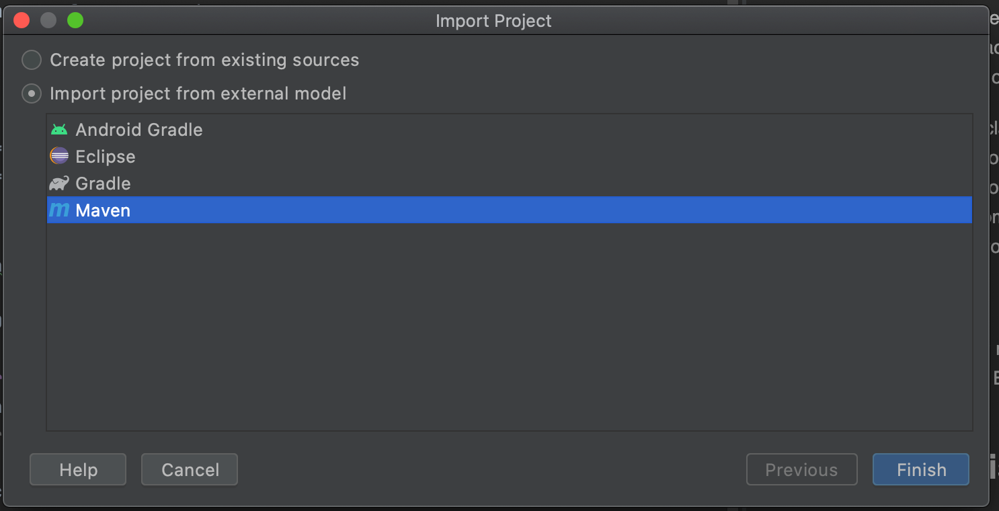
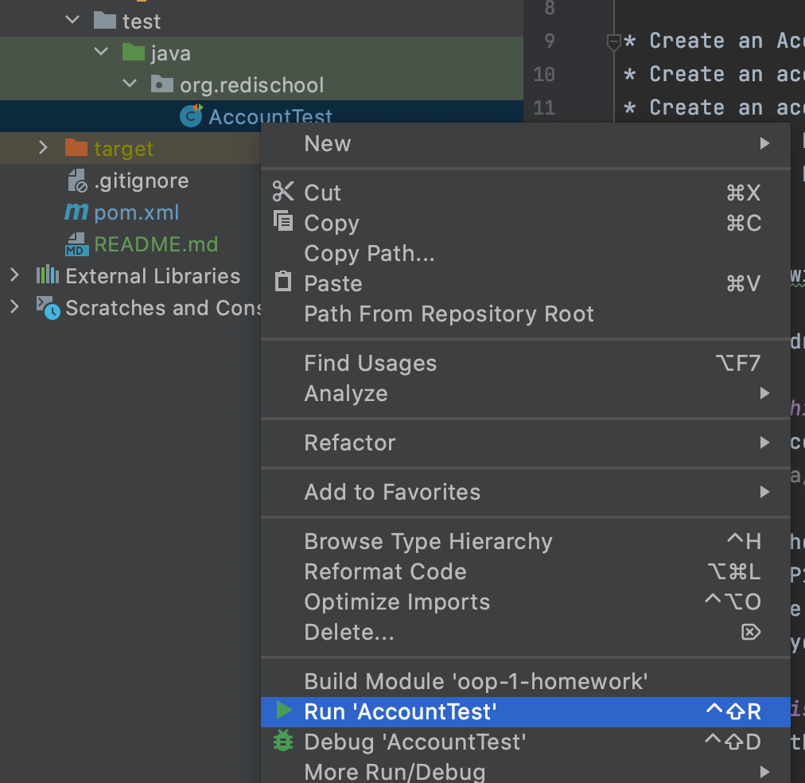
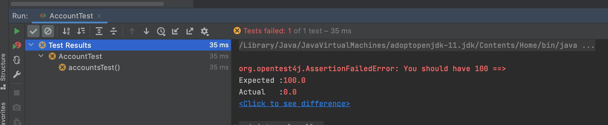

# Intermediate Java Lesson 7: Homework

You want to go to the bank and open an account. You want to be able to transfer money, 
deposit money, withdraw money. When you transfer/withdraw the sum you have in 
your account can never go under 0 EUR. You want to keep track of your transactions 
as well, to see where your money is going. Whenever a new action is performed, 
print the current amount of money you have.

* Create an Account class with specific account attributes and methods like deposit(), withdraw(), transfer().
* Create an account for yourself with 100 Euro in it 
* Create an account for your friend with 200 Euro in it
* Transfer 50 Euro from your account to your friends account.
* Withdraw 10 Euro from your account.
  
*Optional*
* Modify the withdraw method to make sure it does not allow withdrawing more than
is available
* Try to withdraw 100 Euro from your account

## How does this work?
This project contains a basic implementation to get you started at 
`src/main/java/org/redischool/` and a check to verify that your code is working.

You can run the check to make sure your code works as expected. Implement each of the 
methods in OOP1 to do what the description says. Note that you should only create an
account at the beginning in `giveMeYourAccount` and `giveMeYourFriendsAccount`. In the
latter steps you will be given the Account object to work with.

## Running this in IDEA
To work with this code, follow these steps:

* Get the code from GitHub (see the class on Git)
* Open IDEA depending and if:
    * A project is already open, go to the menu File -> New 
      -> Project from existing sources...
    * No project is open (Start screen), click on the Open button
* Select the folder checked out from GitHub
* In Import Project dialog select "Import from external model" and "Maven"

Once the project has finished loading open the `src/test/java/org.redischool` folder
and right-click on AccountTest and select "Run AccountTest"

This will open the following screen and show you the first errors. Now complete the 
code in `src/main/java/org/redischool` until no more error are shown when you run
the test.

Happy coding!
